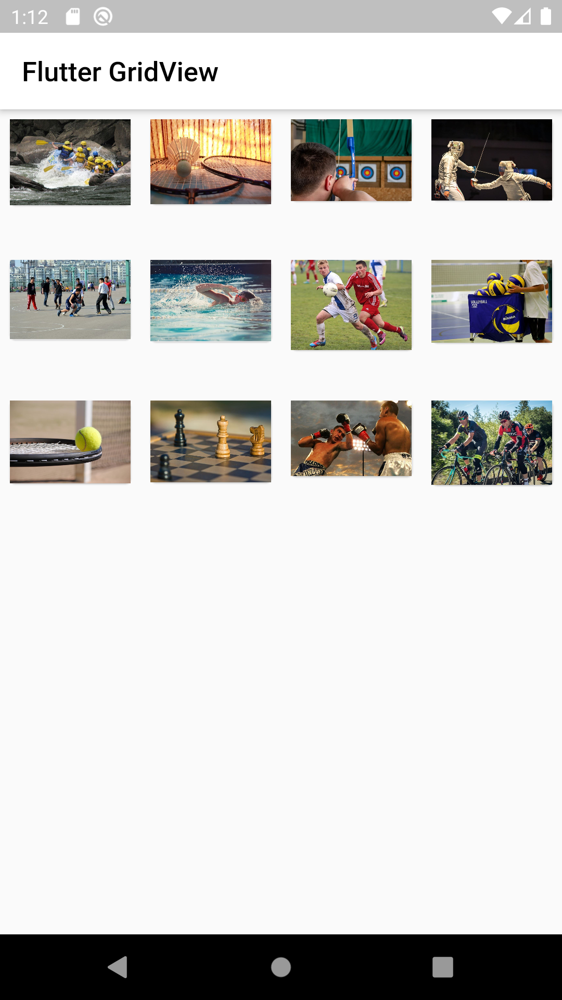

# Flutter Basic Aplication ( Tugas 3 -OSG07 )

Aplikasi Flutter yang dapat berpindah halaman dengan menggunakan widget GridView, ScrollView, dan Route.

## Screenshot
<table>
  <tr>
    <td></td>
    <td></td>
   </tr>
</table>

### Built With
- [Flutter](https://flutter.dev)

### Created By
- [Faisal Ridwan](faisalridwan.com)

---

A few resources to get you started if this is your first Flutter project:

- [Lab: Write your first Flutter app](https://flutter.dev/docs/get-started/codelab)
- [Cookbook: Useful Flutter samples](https://flutter.dev/docs/cookbook)

For help getting started with Flutter, view our
[online documentation](https://flutter.dev/docs), which offers tutorials,
samples, guidance on mobile development, and a full API reference.
